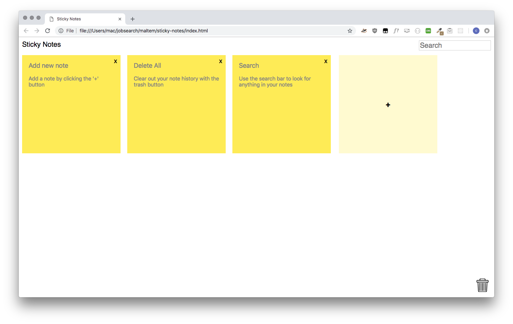

# Sticky Note Application 


### Functions

* Add new notes
* Edit the title and content of the notes
* Delete notes
* Notes are saved automatically on local storage
* Filter notes on title or content using the search bar
* Delete history of all notes
* Mobile friendly
* Compatible with Chrome, Safari, IE >= 10

### Getting started

Launch the app on https://clarakoh.com/sticky-notes

or

* Clone this repo into your local directory

```
git clone https://github.com/claraonmars/sticky-notes.git
cd sticky-notes

```
* Open index.html in your broswer
* If you are on Safari, ensure you check 'Disable Local File Restrictions' in 'Develop'.
* If you are on Chrome, ensure you uncheck 'Block third party cookies' in your preferences.

### Specification

* The code needs to work after we pull it and try it (no bugs).
* The view should be responsive, user-friendly and clear.
* It should work on Chrome, Safari and IE (>= 10).# sticky-notes
